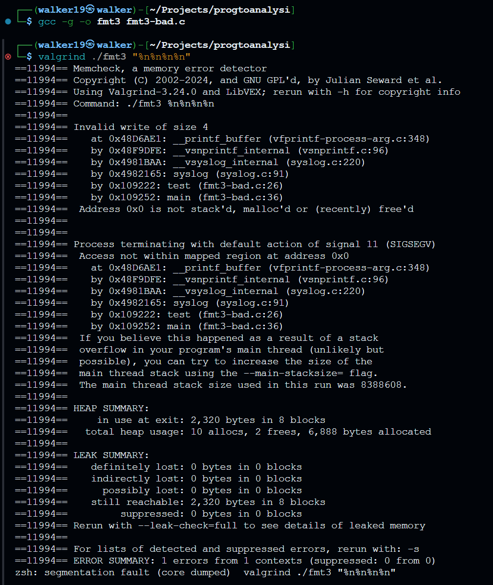

# TASK 2

For this lab, we have selected programs `061`and `077` from SARD Test Suite. The first one is a C program that has a syslog format string vulnerability, and the second one is a C program that has a buffer overflow vulnerability.

- [061 - Format String Vulnerability in syslog](https://github.com/hpacheco/ses/blob/main/c/SARD-testsuite-100/000/149/061/fmt3-bad.c)

    - Category: Use of Externally-Controlled Format String ([CWE-134](https://cwe.mitre.org/data/definitions/134.html))

- [077 - Buffer Overflow Vulnerability](https://github.com/hpacheco/ses/blob/main/c/SARD-testsuite-100/000/149/077/scpy2-bad.c)

    - Category: Buffer Overflow due to Unsafe String Copy ([CWE-120](https://cwe.mitre.org/data/definitions/120.html))

# TASK 3

- [062](https://github.com/hpacheco/ses/blob/main/c/SARD-testsuite-101/000/149/062/fmt3-good.c) - The fix consists of using "%s" as a format specifier in syslog to prevent user input from being interpreted as a format string.

- [078](https://github.com/hpacheco/ses/blob/main/c/SARD-testsuite-101/000/149/078/scpy2-good.c) - The fix consists of changing the length check to prevent buffer overflow before copying the input string. In this case strlen(str) >= MAXSIZE.

# TASK 4

## Program 061 - Format String Vulnerability in syslog

A format string vulnerability (CWE-134) in Program 061 is caused by incorrect use of the syslog() method. When a user-controlled buffer is supplied to syslog() directly as the format string parameter without being properly sanitized, a vulnerability arises. This enables attackers to read from or write to memory regions using format specifiers (such as %x, %p, or %n), which may result in arbitrary code execution, memory corruption, or information exposure.

The key vulnerable code pattern is:

```c
snprintf(buf, sizeof buf, "<%s>", str);
syslog(LOG_CRIT, buf);
```
Despite filtering user input, the whitelist includes the % character, allowing format specifiers to be passed to syslog().

### Tools Used
For analyzing a format string vulnerability (CWE-134), specific tools were selected based on their known strengths and capabilities in detecting these types of vulnerabilities.

#### Static Analysis
- [Flawfinder](https://dwheeler.com/flawfinder/)
- [Cppcheck](http://cppcheck.sourceforge.net/)
- [Clang Static Analyzer](https://clang-analyzer.llvm.org/)

#### Dynamic Analysis
- [Valgrind](http://valgrind.org/)
- [AddressSanitizer (ASAN)](https://clang.llvm.org/docs/AddressSanitizer.html)
- [GDB](https://www.gnu.org/software/gdb/)

### Static Analysis Findings

#### Flawfinder

Chosen because to its specific emphasis on C/C++ code security flaws, especially its well-known patterns for identifying format string problems. Successfully identified the format string vulnerability with a high severity rating (level 4):

```
fmt3-bad.c:26: [4] (format) syslog: If syslog's format strings can be influenced by an attacker, 
they can be exploited (CWE-134). Use a constant format string for syslog.
```

Also identified a potential buffer issue (level 2) related to the statically-sized array. 


#### Cppcheck
Selected as a general-purpose static analyzer capable of detecting a range of coding problems, such as incorrect use of APIs. Did not detect the format string vulnerability, but reported a style issue regarding variable scope:

```
fmt3-bad.c:32:8: style: The scope of the variable 'userstr' can be reduced. [variableScope]
```


#### Clang Static Analyzer
Utilized because of its capacity to monitor data flow and identify possible security risks via path-sensitive analysis but 
failed to detect the format string vulnerability:

```
scan-build: No bugs found.
```


### Dynamic Analysis Findings

#### GDB

We start by compling the program with the `-g` flag to include debugging information. Then, we run the program with the input `"%n%n%n%n"` and set a breakpoint at the syslog() function. We can see that the program crashes with a segmentation fault, indicating a write access violation.


Clearly, the %n format specifier is causing the issue. The program tries to write to an invalid memory address, leading to a segmentation fault, showed by the printf_buffer() function in the call stack.

#### Valgrind

Using the command `valgrind ./fmt3 "%n%n%n%n"`, Valgrind successfully detected the vulnerability with detailed error information:

```
Invalid write of size 4
at 0x48D6AE1: __printf_buffer (vfprintf-process-arg.c:348)
by 0x48F9DFE: __vsnprintf_internal (vsnprintf.c:96)
by 0x4981BAA: __vsyslog_internal (syslog.c:220)
by 0x4982165: syslog (syslog.c:91)
by 0x109222: test (fmt3-bad.c:26)
by 0x109252: main (fmt3-bad.c:36)
Address 0x0 is not stack'd, malloc'd or (recently) free'd
```

Valgrind provided a clear call stack tracing the issue from user code to library functions. Confirmed that the segmentantion fault resulted from an invalid write operation. Was able to identify the vulnerable line in the source code.



#### AddressSanitizer (ASAN)

In this case, the command used was ```gcc -fsanitize=address -g fmt3-bad.c -o fmt3 && ./fmt3 "%n%n%n%n"```. ASAN sucessfully detected the write access violation:

```
AddressSanitizer:DEADLYSIGNAL
ERROR: AddressSanitizer: SEGV on unknown address 0x000000000000 (pc 0x7f4f97d8dae1 bp 0x000000000000 sp 0x7ffce25c14f0 T0)
The signal is caused by a WRITE memory access.
Hint: address points to the zero page.
```

The call stack provided by ASAN was similar to the one provided by Valgrind and GDB, showing the same error in the syslog() function. We were able to confirme that the %n format specifier triggered an invalid write operation.


Tools like as taint analysis tools and TIMECOP (for timing vulnerabilities) were deemed irrelevant for this particular vulnerability class.  In a similar vein, tools that were mainly concerned with other classes of vulnerabilities (such as buffer overflows) were given less priority than those that could more accurately identify incorrect format string handling.

### Vulnerability Impact

This program's format string vulnerability may result in arbitrary code execution, information disclosure, or memory corruption. An attacker could exploit this vulnerability to read or write to arbitrary memory locations, potentially leading to a denial of service, privilege escalation, or other security breaches.

### Conclusion

The analysis of program 061 reveals a classic format string vulnerability in the syslog() function. The vulnerability was successfully detected by Flawfinder, Valgrind, and ASAN, but not by Cppcheck and Clang Static Analyzer. The vulnerability was confirmed by the segmentation fault generated by the %n format specifier. The fix for this vulnerability is to use a constant format string for syslog().


## Program 077 - Buffer Overflow Vulnerability

A typical buffer overflow vulnerability (CWE-120) in Program 077 is caused by poor boundary checking during string copying. A subtle problem with string termination makes the application susceptible to buffer overflow even with an apparent length check.

The key vulnerable code pattern is:

```c
void test(char *str) {
    char buf[MAXSIZE];

    if(strlen(str) > MAXSIZE)
        return;
    strcpy(buf, str);               /* FLAW */
    printf("result: %s\n", buf);
}
```

The vulnerability occurs because strcpy() will copy the string with the null terminator included, even though the check if(strlen(str) > MAXSIZE) merely makes sure that the string length (not including the null terminator) is not more than MAXSIZE. A buffer overflow will occur if the string length equals MAXSIZE because the null terminator will be written one byte past the buffer limit.

### Tools Used
For analyzing a buffer overflow vulnerability (CWE-120), we selected a specialized set of tools optimized for memory safety analysis.

#### Static Analysis
- [IKOS](https://github.com/NASA-SW-VnV/ikos)
- [SPLINT](http://www.splint.org/)
- [Frama-C](https://frama-c.com/)

#### Dynamic Analysis
- [Valgrind](http://valgrind.org/)
- [AddressSanitizer (ASAN)](https://clang.llvm.org/docs/AddressSanitizer.html)

By focusing on the unique features of buffer overflow vulnerabilities using a variety of analysis approaches, including as formal verification, static analysis, and runtime instrumentation, this combination offers more specialized coverage than general-purpose security scanners.

### Static Analysis Findings

#### IKOS

Ikos uses abstract interpretation to analyze the program and detect potential buffer overflows. The command `ikos scpy2-bad.c` was used to analyze the program. Ikos did indentified several potential issues in the code:

```
# Summary:                                                                             
Total number of checks                : 16                                             
Total number of unreachable checks    : 0                                              
Total number of safe checks           : 11                                             
Total number of definite unsafe checks: 0
Total number of warnings              : 5
The program is potentially UNSAFE

home/walker19/Projects/progtoanalysi/scpy2-bad.c: In function 'test':
home/walker19/Projects/progtoanalysi/scpy2-bad.c:10:5: warning: pointer 'str' might be null
        if(strlen(str) > MAXSIZE)
           ^
home/walker19/Projects/progtoanalysi/scpy2-bad.c: In function 'test':
home/walker19/Projects/progtoanalysi/scpy2-bad.c:10:5: warning: memory access might be invalid, could not infer information about pointer 'str'
        if(strlen(str) > MAXSIZE)
           ^
home/walker19/Projects/progtoanalysi/scpy2-bad.c: In function 'test':
home/walker19/Projects/progtoanalysi/scpy2-bad.c:12:2: warning: memory access might be invalid, could not infer information about pointer 'str'
        strcpy(buf, str);                               /* FLAW */
        ^
````


Ikos was able to identify the potential buffer overflow vulnerability in the code. The tool was able to detect the strcpy(buf, str) call as a potential memory access issue, as well as the preceding length check as potentially unsafe.


#### SPLINT

it was selected due to its capacity to carry out lightweight static analysis with a particular focus on buffer overflows and other security flaws. SPLINT successfully detected a potential buffer overflow with high confidence:

```
scpy2.c:14: Warning: Possible buffer overflow using strcpy
A memory write access may write to an object beyond its allocated size.
```


The tool was able to highlifhted the exact line in the source code `strcpy(buf, str);`. Identified that the preceding length check was insufficient and recommended using a bounded string copy function.

#### Frama-C

Chosen for its formal verification capabilities and ability to detect buffer overflows through abstract interpretation. Usinf frama-c, the command `frama-c -eva scpy2-bad.c` was used to analyze the program. Frama-C Analysis identified several potential issues in the code:

```
[eva:alarm] home/walker19/Projects/progtoanalysi/scpy2-bad.c:10: Warning: 
  function strlen: precondition 'valid_string_s' got status unknown.
[eva] using specification for function strcpy
[eva:alarm] home/walker19/Projects/progtoanalysi/scpy2-bad.c:12: Warning: 
  function strcpy: precondition 'valid_string_src' got status unknown.
[eva:alarm] home/walker19/Projects/progtoanalysi/scpy2-bad.c:12: Warning: 
  function strcpy: precondition 'room_string' got status unknown.
```


The strcpy: precondition 'room_string' got status unknown warning is especially important. This shows that Frama-C is unable to confirm that the string being copied has adequate space in the destination buffer.
The research accurately identifies the strcpy(buf, str) call vulnerability, demonstrating that the operation may write over the buffer limits in specific circumstances (where the string length is exactly MAXSIZE).

### Dynamic Analysis Findings

#### Valgrind

In valgrind, the command used was `valgrind --tool=memcheck --leak-check=full ./scpy2 $(python -c 'print("A"*40)')` to try to trigger the buffer overflow. Valgrind do not detected the buffer overflow:

```
All heap blocks were freed -- no leaks are possible
```


#### AddressSanitizer (ASAN)

In this case, the command used was `gcc -fsanitize=address -g scpy2-bad.c -o scpy2_asan && ./scpy2_asan $(python -c 'print("A"*40)')`. ASAN sucessfully detected the buffer overflow:

```
==26851==ERROR: AddressSanitizer: stack-buffer-overflow on address 0x7f4ae0500058 at pc 0x7f4ae278c6a1 bp 0x7ffd3fd9de80 sp 0x7ffd3fd9d640
```

ASAN provided a detailed error message, showing the exact line in the source code where the buffer overflow occurred. The tool was able to identify the issue and provide a clear call stack.


The tool showed specifically that the overflow occurred one byte past the end of the array.

### Vulnerability Impact

The buffer overflow vulnerability in program 077 may result in memory corruption, potential program crashes if critical data is overwritten, or arbitrary code execution if an attacker can control the overwritten data. An attacker could exploit this vulnerability to overwrite the return address on the stack, leading to arbitrary code execution.

### Conclusion

The analysis of program 077 reveals a buffer overflow vulnerability caused by incorrect boundary checking during string copying. The vulnerability was successfully detected by Frama-C, SPLINT and ASAN, but not by Valgrind. The vulnerability was confirmed by ASAN, which showed a stack-buffer-overflow error. The fix for this vulnerability is to ensure that the length check is correct and that the string is copied safely using a bounded string copy function.

# Results Overview

- 077 - Buffer Overflow due to Unsafe String Copy ([CWE-120](https://cwe.mitre.org/data/definitions/120.html))
- 061 - Format String Vulnerability in syslog ([CWE-134](https://cwe.mitre.org/data/definitions/134.html))


| Tool             | 077 (Buffer Overflow) | 061 (Format String) |
| ---------------- | --------------------- | ------------------- |
| IKOS             | ⚠️ Partially          | N/A                 |
| SPLINT           | ✅                    | N/A                 |
| Frama-C          | ⚠️ Partially          | N/A                 |
| Valgrind         | ❌                    | ✅                   |
| AddressSanitizer | ✅                    | ✅                   |
| Flawfinder       | N/A                   | ✅                   |
| Cppcheck         | N/A                   | ❌                   |
| Clang Static     | N/A                   | ❌                   |
| GDB              | N/A                   | ✅                   |

Legend: ✅ Detected; ❌ Not Detected; ⚠️ Partially Detected; N/A Not Tested