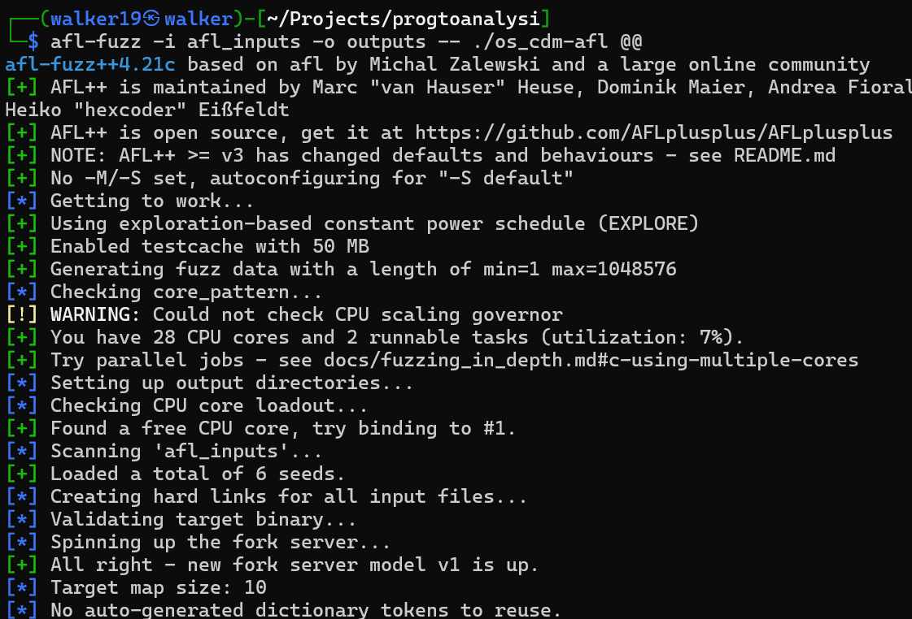
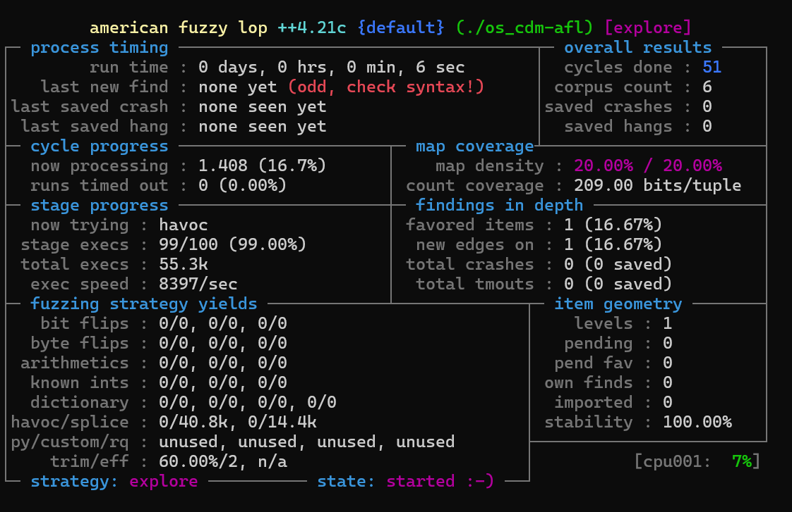
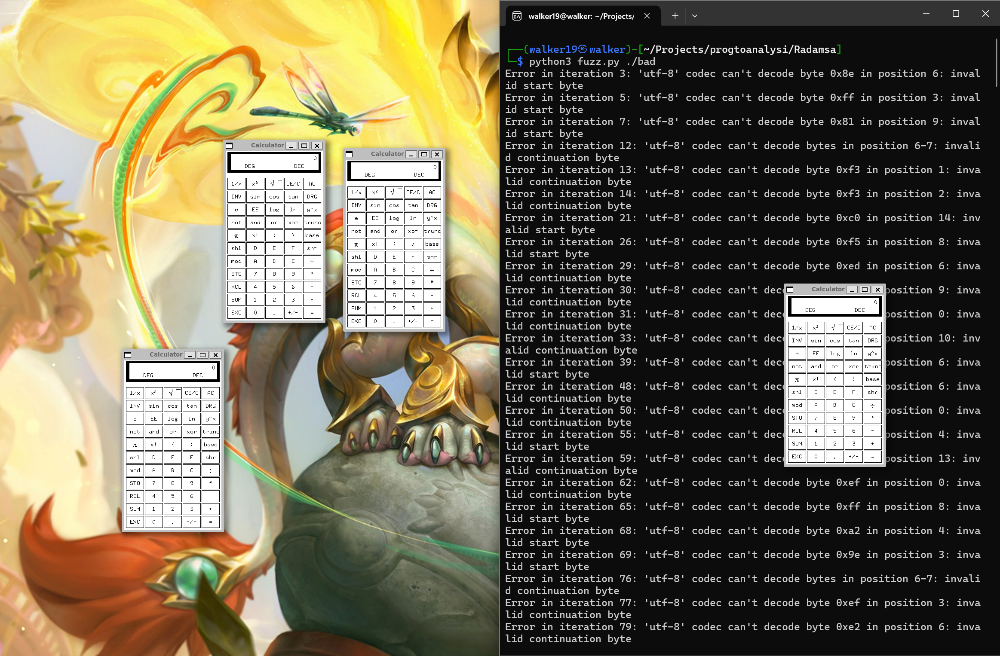

# Lab 2 - Testing for security

## 1. Introduction

In this lab, we investigate automated testing methods for identifying C programs' security flaws. In particular, we compare symbolic execution and fuzzing, two popular testing methods.

Serious security flaws known as command injection let attackers execute arbitrary commands on a target system. Command injection vulnerabilities are common in C programs that use system calls to execute shell commands. They usually happen when system commands use user input that hasn't been thoroughly cleaned.

We hope to learn which testing strategies are best for finding these kinds of flaws in our target program by contrasting them. The tools used reflect distinct approaches to security testing: KLEE employs symbolic execution to methodically investigate execution paths, AFL guides its testing with program instrumentation and coverage feedback, and Radamsa creates random mutations without knowing the program's structure.

This comparison sheds light on their respective pratical applicability, efficacy, and limitations.

## 2. Selected Vulnerable Program

For this lab, we chose the program, [151 - os_cmd_local_flow-bad.c](https://github.com/hpacheco/ses/blob/main/c/SARD-testsuite-100/000/149/151/os_cmd_local_flow-bad.c) , inside the SARD-testsuite-100 collection. A command injection vulnerability exists in this program, which allows user input to be directly merged into a shell command without being properly sanitized.

The vulnerable program is a simple C program that takes a user input and executes a shell command using the `system()` function. The program is as follows:

```c
#include <string.h>
#include <stdlib.h>
#include <stdio.h>
#include <stdbool.h>


#define SIZE_CMD 10
const char cmd[SIZE_CMD] = "/bin/cat ";


int main(int argc, char *argv[])
{
	char sys[512];
	char buff[512];

	if (fgets(buff,512 - SIZE_CMD,stdin))
	{
		strcpy(sys, cmd);
		strcat(sys, buff);

		switch(1==1){
			case true:
				if(system(sys) < 0)					/* FLAW */
					fprintf(stderr, "system() failed");
			default:
				break;
		}
	}
	return 0;
}
```

This program reads input from stdin, concatenates it with the command `/bin/cat`, and executes the resulting command using the `system()` function. The program is vulnerable to command injection because it does not properly sanitize. If the user provides input containing shell metacharacters like `;` , `|` or `&&`, they can execute arbitrary commands on the system.

## 3. Testing Setup
### 3.1 Radamsa (Black-box Fuzzing)
Radamsa is a mutation-based, black-box fuzzing tool that creates test cases by randomly changing seed inputs without revealing the internal workings of the program. We started our Radamsa fuzz by compile the original program using the following command:

```bash
gcc -o os_cmd_local_flow-bad os_cmd_local_flow-bad.c
```

In Radamsa, no special instrumentation is needed since it doesn't require any knowledge of the program's structure. We made seed inputs that included both typical scenarios and patterns that were similar to command injection. This seed inputs were stored in a specific directory and included standard input files like ```test.txt``` and inputs with possible injection characters like ```file.txt;``` and ```file.txt|```. Radamsa uses these seeds as a starting point to produce mutations. Then we created a Python script (fuzz.py) to automate the testing process. It would take each mutation produced by Radamsa and feed it into our script, keeping an eye out for any strange activity. With each changed input, the script executes the program, records error messages and return codes, and sotres any inputs that seem to be problematic. The script used was something like this:

```python
#!/usr/bin/env python3
import subprocess
import sys
import os
import signal
import time

if len(sys.argv) < 2:
    print("Usage: %s <program>" % sys.argv[0])
    sys.exit(1)

program = sys.argv[1]
input_file = "inputs/1"

# Function to run the program with a given input
def run_with_input(input_data):
    try:
        process = subprocess.Popen([program], 
                                  stdin=subprocess.PIPE,
                                  stdout=subprocess.PIPE,
                                  stderr=subprocess.PIPE)
        stdout, stderr = process.communicate(input=input_data.encode(), timeout=1)
        return process.returncode, stdout, stderr
    except subprocess.TimeoutExpired:
        process.kill()
        return -1, b'', b'Timeout'

# Main fuzzing loop
for i in range(1000):  # Number of mutations to try
    # Generate a mutation using radamsa
    try:
        mutation = subprocess.check_output(["radamsa", input_file, "-s", str(i)]).decode()
        
        # Run the program with the mutated input
        ret, stdout, stderr = run_with_input(mutation)
        
        # Check for suspicious behavior
        if ret != 0 or b"failed" in stderr:
            print(f"Potential issue found with input: {mutation.strip()}")
            with open(f"crash_{i}", "w") as f:
                f.write(mutation)
            print(f"Return code: {ret}")
            print(f"Stderr: {stderr.decode()}")
    except Exception as e:
        print(f"Error in iteration {i}: {e}")
```

We test our program with this fuzzing script running him with the following command:

```bash
python3 fuzz.py ./os_cmd_local_flow-bad
```

By using this method, we were able to create a large number of potentially harmful inputs and track how the software behaved while processing them. Radamsa is a real black-box technique to vulnerability discovery because, unlike AFL (we will see AFL in section 3.3), it is unaware of the internal workings of the program and creates test cases only using mutation strategies.

### 3.2 KLEE (Symbolic Execution)

KLEE is a symbolic execution tool that systematically examines program pathways by treating inputs as symbolic values rather than concrete ones. We first built a modified version of the application especially for symbolic analysis in order to conduct our test. This updated version included assertions to identify command injection patterns and substituted symbolic inputs for the stdin reading.

```c
#include <string.h>
#include <stdlib.h>
#include <stdio.h>
#include <stdbool.h>
#include <klee/klee.h>

#define SIZE_CMD 10
const char cmd[SIZE_CMD] = "/bin/cat ";

int main() {
    char sys[512];
    char buff[512];

    // Create a symbolic buffer for user input
    klee_make_symbolic(buff, sizeof(buff), "buff");
    
    // Ensure null-termination of the symbolic input
    klee_assume(buff[511] == '\0');
    
    // Construct the command
    strcpy(sys, cmd);
    strcat(sys, buff);
    
    // Check for command injection patterns - comprehensive set
    if (strstr(sys, ";") || strstr(sys, "|") || strstr(sys, "&&") || 
        strstr(sys, "||") || strstr(sys, "`") || strstr(sys, "$")) {
        // Potential command injection found!
        klee_assert(0);
    }
    
    // We don't actually execute the command in KLEE
    // In the real program, this would be: system(sys)
    
    return 0;
}
```

The altered program uses ```#include <klee/klee.h>``` to include the KLEE header and ```klee_make_symbolic(buff, sizeof(buff), "buff")``` to build a symbolic buffer. Semicolons, pipes, and other shell metacharacters are examples of command injection patterns that we explicitly checked for and marked with an assertion that would fail if they were found. Additionally, we made sure that the symbolic input was null-terminated using ```klee_assume(buff[511] == '\0')``` in order to avoid taking incorrect strings into account.

To execute KLEE, we first moved to the VM directory and started the KLEE Docker container using ```make run-klee``` in the ses/vm directory. Then we used ```clang -I /home/klee/klee_src/include/ -emit-llvm -c -g -O0 -Xclang -disable-O0-optnone os_cmd_local_flow-klee.c``` to compile the program to LLVM bitcode inside the container. The C code is converted to LLVM bitcode for KLEE to analyze at this compilation stage. Lastly, we started the symbolic analysis process by running KLEE on the bitcode file using ```klee --libc=uclibc os_cmd_local_flow-klee.bc```.
KLEE looks for inputs that defy the assertions we added by methodically investigating execution pathways. The assertions were created especially for our software to highlight command injection patterns, enabling KLEE to spot inputs that can result in security flaws.

### 3.3 AFL (Grey-box Fuzzing)

Coverage-guided feedback is used by the Grey-box fuzzing tool American Fuzzy Lop (AFL) to identify intriguing inputs that cause the target program to take novel code paths. We used the command ```AFL_HARDEN=1 os_cmd_local_flow-bad afl-clang-fast.os_cmd_local_flow-bad-afl c -o.``` to enable coverage feedback after compiling the program with AFL instrumentation in order to test our susceptible software. AFL is able to monitor which code segments are run with various inputs thanks to this instrumentation.
Then, in order to direct AFL toward possible command injection patterns, we developed certain seed inputs. Using ```mkdir -p afl_inputs```, we established a directory for these inputs and produced a number of seed files, including standard inputs like test.txt and inputs that included characters that may be used for command injection, such as semicolons, pipes, and ampersands, it was used the same method as the one used in section 3.1.
Lastly, we used 



to run AFL with these inputs. 

AFL offers real-time visual feedback during execution that displays pathways explored, crashes found, and code coverage. Our software reads from stdin, thus we set up AFL to handle this input method appropriately so that test cases could be fed into the program in the right way.



## 4. Testing Results 
### 4.1 Radamsa Results

The usefulness of Radamsa in identifying the command injection vulnerability through random mutation was demonstrated by our testing.



After about 80-90 rounds, the tool identified several inputs that caused the vulnerability. Distinct crash files with variety of command injection patterns were gathered.


These featured shell variable references ```($path, $1)```, command substitution ```($(xcalc))```, backtick execution ```(`xcalc`)```, and different shell metacharacters.

``` Test.txt{xcalc` ``` was one instance of a malicious input that was discovered; it would lauch the calculator program. Radamsa produce a vast array of mutations, frequently fusing special characters and format string patterns with command injection. This method, which did not know the structure of the application, was successful in identifying the vulnerability.

### 4.2 KLEE Results

KLEE was remarkably successful in locating our vulnerability to command injection. Within seconds of lauching execution, it identified the vulnerability, displaying the following output: 

```
"KLEE: ERROR: os_cmd_local_flow-klee.c:28: ASSERTION FAIL: 0".
```


Upon completion, KLEE explored 406,516 partially completed paths and 8266 completed paths, producing 144811 test cases. During its analysis, KLEE carried out 48145995 instruction in total. 

KLEE discovered a semicolon (';') as the first character in the input buffer, which would case command injection, according to an nalysis of the first test case (test000001.ktest). This specific example was a minimal situation; all that was needed to exploit the issue was to begin the input with a semicolon.

Because KLEE's symbolic execution engine could directly examine the code path where input is concatenated to the command string and reason about the circumstances that would result in command injection, it was incredibly successful in identifying this issue. The large number of test cases and paths investigated shows how thoroughly KLEE examined the application, guaranteeing that all possible vulnerabilities were covered.


### 4.3 AFL Results

We learned a lot about the nature of command injection vulnerabilities from our experience with AFL. AFL found no crashes in the application after it ran for almost eighteen minutes and ran over 9.11 million test cases over 8372 cycles. 


The fuzzer ran at about 5040 executions per second while exploring six distinct execution paths (corpus count). No crashes were found even when seed inputs with shell metacharacters were used. 

This outcome provides insight on vulnerabilities related to command injection.

Command Injection vulnerabilities do not always result in software crashes, in contrast to buffer overflows or other memory corruption problems. Rather, they permit the execution of commands without authorization while the program functions properly.

Because of this feature, they could be more difficult to find with crash-focused fuzzing tools like AFL. However, just because AFL didn't detect crashes doesn't mean the vulnerability doesn't exist; it just means it doesn't show up as a crash.

## 5. Comparing the Approaches
### 5.1 Effectiveness

Radamsa used random mutation to discover the vulnerability, however it took several tries and produced a lot of pointless inputs.  Although its strategy was a little erratic, it was eventually successful in spotting patterns of exploitation.  Because the command injection vulnerability doesn't result in crashes, AFL effectively investigated program paths but failed to identify it.  Despite using a coverage-guided methodology, AFL completely overlooked our command injection problem since it focused on crashes as a sign of vulnerabilities.  KLEE was very accurate; using symbolic reasoning about string operations, it was able to discover the issue right away.  It was especially well-suited for this type of vulnerability since it could directly examine the circumstances that led to command injection.

### 5.2 Efficiency

Despite being easier to set up, Radamsa is less effective at identifying specific vulnerabilities; it requires a lot of iterations and generates a lot of false positives that require manual review.  AFL essentially wasted computing resources on a vulnerability type it is not well-suited to locate because it was unable to identify the non-crashing vulnerability despite processing millions of executions rapidly (more than 9 million in 18 minutes).  KLEE needed further configuration, such as code modification and a certain compilation, but once it was up and running, it discovered the issue relatively immediately.  Its method was focused and accurate, utilizing investigation time for this specific vulnerability type well.

### 5.3 Coverage

Radamsa does not ensure systematic program exploration; instead, it offers random coverage based on its mutations.  Chance and the caliber of the original seed inputs play a major role in its coverage.  By concentrating on inputs that initiate new code pathways, AFL cleverly examined the program's state space, offering superior coverage with little assistance from humans.  It was able to identify which inputs were revealing new program behaviors thanks to its instrumentation.  KLEE ensured thorough coverage of the examined code sections by methodically investigating every potential route down to a specific depth.  It was able to consider any input that could cause the vulnerability conditions because of its symbolic methodology.

### 5.4 Usability

The simplest to set up, Radamsa needed specific scripting to automate testing and analyze findings.  To feed inputs into the software and record outcomes, we had to develop a Python script.  Although AFL needed instrumentation, it offered a great visual interface and automatic analysis, which made it simpler to comprehend the fuzzing process and outcomes.  KLEE offered more accurate vulnerability information, but it also involved modifying the application and defining certain security assumptions.  The additional work required to set up KLEE paid off, since this vulnerability yielded more thorough and actionable information.

## 6. Conclusion

The complementing advantages and disadvantages of each technique were demonstrated by our testing of the command injection vulnerability using three distinct approaches: grey-box fuzzing with AFL, black-box fuzzing with Radamsa, and symbolic execution with KLEE.
For this particular vulnerability, KLEE's symbolic execution worked best, quickly and easily determining the precise circumstances that result in command injection.  Within seconds of beginning the investigation, it discovered a straightforward, minimal test case (a semicolon at the beginning of the input) that would cause the vulnerability.  The 144,811 test cases that KLEE produced while examining 8,266 finished pathways demonstrate how comprehensive its methodology is.

Even though Radamsa is a black-box fuzzer and has no understanding of program structure, it was nonetheless able to identify the vulnerability.  In roughly 80–90 iterations, it found several inputs with command injection patterns.  To determine which particular mutation patterns caused the vulnerability, however, a manual examination of the crash data was necessary.

Even after 18 minutes and more than 9 million executions, AFL, which is effective at identifying a wide variety of flaws, failed to detect any crashes associated with this command injection vulnerability.  This draws attention to a crucial aspect of command injection vulnerabilities: they frequently don't result in crashes, which makes it more difficult to find them using crash-focused fuzzing techniques.

This experiment showed that the best successful testing strategy depends greatly on the type of vulnerability.

