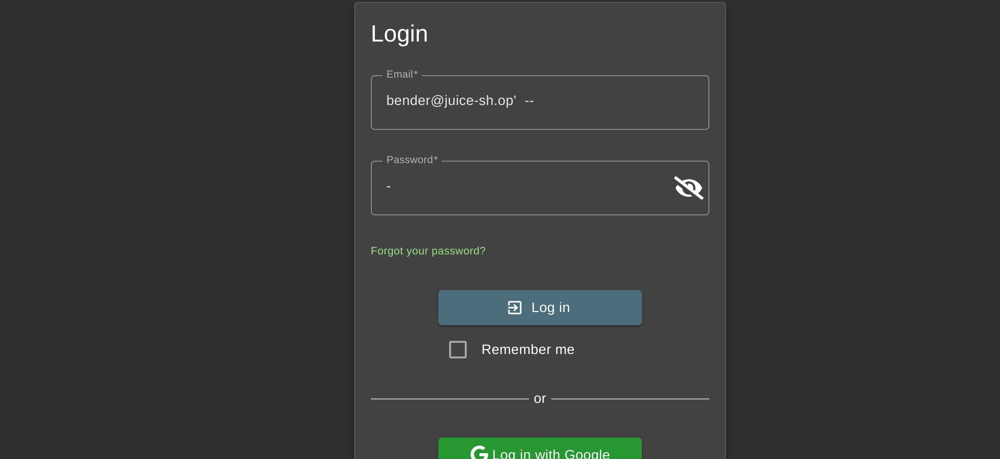
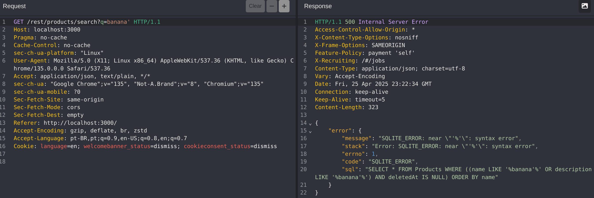
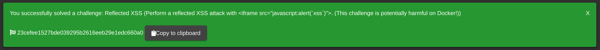

# Lab 3 - Web security

## Introduction

In this lab, we analyze the security of web applications using techniques and tools such as SAST, DAST, IAST, OWASP ZAP, SonarCloud, Caido, among others. We used the OWASP Juice Shop, an intentionally vulnerable web application, as a basis, with the aim of identifying and understanding real vulnerabilities in controlled environments.

## 1. Challenges solved

### 1.1. Login Bender / Login Jim
The first step was to find the e-mail domain used in the application. All it took was a quick search among the reviews and we were able to identify that the format is "@juice-sh.op".


So now we can try to log in as the user Bender, the first attempt was to enter a simple payload in the password field.


But as we didn't succeed, we tried a different approach, inserting the payload directly into the login field after the email.


Which resulted in a successful login as Bender.


In the same way, we can log in as both Bender and Jim.


---

### 1.2. Database Schema / User Credentials

At this stage, the Caido tool (which serves the same purpose as Burp Suite) was used to inspect and analyze the requests made to the application. As an initial test, a search for the word "banana" was performed. As shown in the image below, the search is carried out using the "q" parameter, which appears in the URL.


In the "HTTP History" tab, it is possible to review all communication between the application and our computer.


Among them, it is possible to see in ID 621 the request made for the search term "banana", which is performed through the path `/products/search`. Therefore, we will use this information to make a direct request using Caido.


In the "Replay" tab, we can reuse standard requests already made by the system when a search is performed (such as the one with ID 614) and modify the request path to `/products/search`. As a response, we receive the search results. From this point on, we begin testing queries for SQL Injection.


The first step was to insert a single quotation mark after the search query to observe how the application would respond.


The application accepted the injection of the character, so we proceed by closing the parentheses after the single quotation mark, allowing us to initiate a new query.


We can now insert the rest of the payload `'))UNION%20SELECT%20sql,2,3,4,5,6,7,8,9%20FROM%20sqlite_master--`, where:

- `'))` properly closes the parentheses and quotation marks from the original query.

- `UNION SELECT sql,2,3,4,5,6,7,8,9` is used to merge the results of another query with the original one.  
  * `sql` returns the DDL (Data Definition Language) of the tables.  
  * The numbers 2 to 9 serve as filler to match the number of columns expected by the original query.

- `FROM sqlite_master`  
  * `sqlite_master` is a special table in SQLite databases that contains metadata about all tables, indexes, views, and triggers in the database.


Upon returning to the browser, we can see the success message for the **Database Schema** challenge.


Continuing along the same way, we identify that the name of the user table is **"Users"**. Therefore, we can craft a payload to attempt to extract user data. Following a similar logic to the previous payload, we use:  
`'))UNION%20SELECT%20id,username,email,password,5,6,7,8,9%20FROM%20Users--`,  
which returns the user credentials as a result.


Back in the browser, we are presented with the success message for the **User Credentials** challenge.


---

### 1.3. GDPR Data Erasure
In this challenge, the attempt was to log in with a deleted user account.

Thus, still using the Caido tool and slightly modifying the query used in the previous challenge, we can find a user with the email "chris.pike@juice-sh.op" whose account was deleted on "2025-04-17 17:14:57.767".


Just like in the solution for Challenge 1 "Login Bender", our first attempt was to use a simple payload after the user's email. 


And with that, this challenge is solved in a simple way.


For a more personalized test, we created our own account in the application using the user email `teste@teste.com`.


The ID 24 was assigned to it.


We deleted this user.


However, the request is not actually processed by the system.


Despite the message, the user is still active, as we can see from the "null" return in the "deluxePrice" field.


Therefore, since the operation was not processed, we are able to log in normally.


---

### 1.4. Reflected XSS

To exploit the XSS Reflected vulnerability, it was necessary to simulate an order through the application.


When we click on the button to locate the request made, we can see that the ID is passed via the GET parameter and is also displayed on the page, so we can inject a payload into this parameter.
!

The first attempt was with a simple payload: `<script>alert(“xss”</script>`, but without success.


With some research into XSS payloads, we found a “classic” one for iframe `<iframe src="javascript:alert(“xss”)">`, and when we tested it in the application we got a positive result.


Together with a challenge solved message.


The `<iframe src="javascript:alert('xss')">` payload exploits the execution of JavaScript code from a malicious URI inserted into the src attribute of an iframe. It works when the application inserts user data into the DOM without proper sanitisation, allowing the browser to interpret the injection as valid HTML and execute the embedded JavaScript, resulting in a Reflected XSS vulnerability.

This payload only takes effect if the injected value is inserted into the DOM as HTML (and not as text). This means that the application:
* Does not escape HTML characters (such as <, > and ");
* Directly inserts user input values into the HTTP response as part of the DOM;
* Does not have a Content Security Policy (CSP) strong enough to block `javascript:` URIs.

---

### 1.5. View Basket / Forged Review

For this challenge, we logged in as an administrator and accessed our shopping basket, but it was not possible to identify the basket ID through the URL. Therefore, we will use Caido.


When making the request through Caido, we can see the basket ID, in our case 1.


Now let's try to access the product basket of other users by changing the value of this request to 2, for example.


This way, we confirm the IDOR vulnerability in the application and successfully complete the challenge.


Let's test with more users:

ID 1:


ID 2:


ID 3:


ID 24 ("teste" user):


We also solved the ‘Forged Review’ challenge, where we started by analysing the request made when we send a review to the application. In the image below we can see that the comment is made simply by passing just two parameters, the message and the author.


By changing the value passed in ‘author’ and seeing how the application behaves, we can see that we have received a success status.


In the application we can now see the message with the e-mail address we changed.


And we also see the message of success in solving the challenge.


---

## 2. Vulnerability Classification

### 2.1. Login Bender / Login Jim

- **Category:** Injection
- **Description:** The exploited vulnerability makes it possible to manipulate the SQL query executed by the backend at the time of authentication. By inserting a payload such as `bender@juice-sh.op'--` into the e-mail field, it is possible to comment out the rest of the SQL clause, bypassing the password check. This is because the user's input is not properly sanitized before being used directly in the database query.
- **CWE:** CWE-89: Improper Neutralization of Special Elements used in an SQL Command ('SQL Injection')
- **Mitigation:** The main way to mitigate this vulnerability is by using prepared statements (parameterized queries), which separate data and SQL commands. In addition, it is important to validate and sanitize user input and use secure ORMs that handle this input correctly.

---

### 2.2. Database Schema / User Credentials

- **Category:** Injection
- **Description:** The vulnerability is an SQL injection, where user input is directly inserted into an SQL query without proper sanitization or parameterization. This allows an attacker to manipulate the query structure and retrieve sensitive data. In this case, the attacker exploited the vulnerability to access the **sqlite_master** table, which contains information about the database schema, and later extracted user credentials from the **Users** table.
- **CWE:** CWE-89: Improper Neutralization of Special Elements used in an SQL Command ('SQL Injection')
- **Mitigation:** To mitigate this vulnerability, the application should use parameterized queries or prepared statements to handle user input safely. This ensures that user input is treated as data and not executable code, preventing malicious injection of SQL commands.

---

### 2.3. GDPR Data Erasure

- **Category:** Broken Authentication
- **Description:** The application fails to properly handle personal data deletion requests, violating GDPR requirements. Although the user appears to be deleted, personal data such as email, profile image, and authentication tokens remain in the database. This incomplete deletion process exposes sensitive user information and fails to ensure user privacy.
- **CWE:** CWE-285: Improper Authorization
- **Mitigation:** Ensure that all personal data associated with a user is either fully anonymized or permanently deleted when processing data erasure requests. Use Sequelize's update method to nullify or remove sensitive fields, or perform a hard delete with force: true. Additionally, verify that no residual data remains in other related tables or logs.

---

### 2.4. XSS

- **Category:** Cross-Site Scripting
- **Description:** Reflected XSS occurs when user-supplied data is immediately included in a server response without proper validation or coding. In Juice Shop, this vulnerability can be exploited by injecting malicious scripts into URL parameters that are reflected in HTML pages, allowing arbitrary code to be executed in the victim's browser.
- **CWE:** CWE-79: Improper Neutralization of Input During Web Page Generation ('Cross-site Scripting')
- **Mitigation:** Validate and sanitise all input data provided by the user; Use secure libraries/frameworks that automatically escape data when rendering HTML; Implement Content Security Policy (CSP) to reduce the impact of any failures; Avoid building HTML with concatenated strings that contain dynamic data.

---

### 2.5. View Basket

- **Category:** Broken Access Control / Insecure Direct Object Reference (IDOR)
- **Description:** The application allows users to access the contents of other users' shopping baskets simply by manipulating numeric identifiers (IDs) in request parameters. This is because there is no proper check that the requested basket actually belongs to the authenticated user.
- **CWE:** CWE-639: Authorization Bypass Through User-Controlled Key
- **Mitigation:** Always associate sensitive resources, such as shopping carts, with the identity of the authenticated user in the backend, without relying on values provided by the client to determine ownership. Check that the resource ID belongs to the logged-in user before displaying any information. Also, implement strict role-based and session-based access controls.

---

## 3. Code Analysis

### 3.1. Login Bender / Login Jim
- **Vulnerable Code Snippet:**
```javascript
models.sequelize.query(`SELECT * FROM Users WHERE email = '${req.body.email || ''}' AND password = '${security.hash(req.body.password || '')}' AND deletedAt IS NULL`, { model: UserModel, plain: true })
      .then((authenticatedUser) => { 
        const user = utils.queryResultToJson(authenticatedUser)
        if (user.data?.id && user.data.totpSecret !== '') {
          res.status(401).json({
            status: 'totp_token_required',
            data: {
              tmpToken: security.authorize({
                userId: user.data.id,
                type: 'password_valid_needs_second_factor_token'
              })
            }
          })
        } else if (user.data?.id) {
          afterLogin(user, res, next)
        } else {
          res.status(401).send(res.__('Invalid email or password.'))
        }
      }).catch((error: Error) => {
        next(error)
      })
  }
```
The vulnerable code builds a SQL query by concatenating user input directly into the query string, without sanitization or the use of prepared statements.

This is because when you enter the email `bender@juice-sh.op'--` the QUERY looks like this:

`SELECT * FROM Users WHERE email = 'bender@juice-sh.op'--' AND password = '${security.hash(req.body.password || '')}' AND deletedAt IS NULL`

Where `SELECT * FROM Users WHERE email = 'bender@juice-sh.op'` is executed normally, but `--' AND password...` is turned into a comment and ignored, causing the QUERY to return a SELECT from the user with the email bender@juice-sh.op.

- **Path/File/Line:**
  - *Path:* /routes/login.ts
  - *Line:* 34
  - *URL:* https://github.com/juice-shop/juice-shop/blob/master/routes/login.ts#L34

- **Suggested fix**: 
```javascript
// Buscar usuário apenas pelo email
models.sequelize.query(
  'SELECT id, email, password, role FROM Users WHERE email = ? AND deletedAt IS NULL',
  {
    replacements: [req.body.email || ''],
    type: models.sequelize.QueryTypes.SELECT,
    plain: true
  }
)
.then((user) => {
  if (!user) {
    // Realizar uma operação de hash com tempo constante (evitar timing attacks)
    security.comparePasswordWithConstantTime('dummy', security.hash('dummy'));
    return res.status(401).json({ status: 'error', message: 'Authentication failed' });
  }
  
  // Verificar senha com comparação de tempo constante
  const isPasswordValid = security.comparePasswordWithConstantTime(
    security.hash(req.body.password || ''),
    user.password
  );
  
  if (!isPasswordValid) {
    return res.status(401).json({ status: 'error', message: 'Authentication failed' });
  }
  
  // Preparar objeto de usuário seguro para a sessão
  const sessionUser = {
    data: {
      id: user.id,
      email: user.email,
      role: user.role
    }
  };
  
  // Chamar função de afterLogin com dados sanitizados
  afterLogin(sessionUser, res, next);
})
.catch((error) => {
  // Log do erro
  console.error('Login error:', error);
  res.status(500).json({ status: 'error', message: 'An unexpected error occurred' });
});
```

Why does the solution work?

1. **Prevents SQL Injection**
   The query uses `replacements` instead of direct string interpolation, which effectively blocks malicious SQL commands injected via `req.body.email`.

2. **Removes Password Comparison from SQL**
   Instead of validating both `email` and `password` directly in the SQL query (as in the vulnerable code), the new approach **retrieves the user by email only** and performs password verification securely within the application logic.

3. **Protects Against Timing Attacks**
   If the user is not found, the system still calls `comparePasswordWithConstantTime()` using fixed dummy values.
   This ensures that the response time remains consistent whether or not the email exists in the database, mitigating **timing-based user enumeration attacks**.

4. **Secure Password Comparison**
   The fix uses `comparePasswordWithConstantTime()` to prevent insecure string comparisons (like `==` or `===`).
   Also, the password from the request is **hashed before comparison**, matching the secure format stored in the database.

5. **Principle of Least Privilege**
   The SQL query only selects the necessary fields: `id`, `email`, `password`, and `role`.
   Sensitive fields such as `securityAnswer` or `totpSecret` are excluded from the result, reducing the exposure of private data.

6. **Sanitized Session Object**
   The `sessionUser` object passed to the login logic **does not include the password**, preventing accidental leakage in logs, tokens, or other session data structures.

7. **Robust Error Handling**
   Errors are caught and logged on the server side without exposing internal details to the client.
   This prevents attackers from gaining insights into the system’s structure or failure modes.

---

### 3.2. Database Schema / User Credentials
- **Vulnerable Code Snippet:**

The vulnerability exists specifically due to the way the `criteria` parameter is handled and used in the query. The value of `criteria` is taken directly from `req.query.q`, which is user-controlled input, and then this value is directly injected into the SQL string on line 23:

```javascript
models.sequelize.query('SELECT * FROM Products WHERE ((name LIKE '%${criteria}%' OR description LIKE '%${criteria}%') AND deletedAt IS NULL) ORDER BY name')
```

There is no secure sanitization or use of bound parameters (prepared statements).

This results in a query with no validation or handling of user input. When we send a payload such as:
`'))UNION SELECT sql,2,3,4,5,6,7,8,9 FROM sqlite_master--`

The query is interpreted as follows:
`SELECT * FROM Products WHERE ((name LIKE '%')) UNION SELECT sql,2,3,4,5,6,7,8,9 FROM sqlite_master--%' OR description LIKE '%')) UNION SELECT sql,2,3,4,5,6,7,8,9 FROM sqlite_master--%' AND deletedAt IS NULL) ORDER BY name`

The payload closes what the original SQL statement was expecting and injects an entirely new query without breaking the syntax, using `UNION`.  
As a result, the database executes the malicious code normally.


- **Path/File/Line:**
  - *Path:* /routes/search.ts
  - *Line:* 23
  - *URL:* https://github.com/juice-shop/juice-shop/blob/master/routes/search.ts#23

- **Suggested fix**: 
```javascript
models.sequelize.query(
  'SELECT * FROM Products WHERE ((name LIKE :search OR description LIKE :search) AND deletedAt IS NULL) ORDER BY name',
  {
    replacements: { search: `%${criteria}%` },
    type: models.sequelize.QueryTypes.SELECT
  }
)
```

Using this suggested fix, the final query becomes:
`SELECT * FROM Products WHERE ((name LIKE '%'')) UNION SELECT sql,2,3,4,5,6,7,8,9 FROM sqlite_master--%' OR description LIKE '%'')) UNION SELECT sql,2,3,4,5,6,7,8,9 FROM sqlite_master--%') AND deletedAt IS NULL) ORDER BY name`

- **Use of :search:** The query now uses a named placeholder (:search) instead of manually concatenating user input into the SQL string.

- **Use of replacements:** Sequelize automatically escapes the value passed in replacements to prevent any attempt at SQL injection.

When using replacements, Sequelize (and the underlying database driver) escapes dangerous characters (like ', --, ;, etc.), treating the input strictly as a literal value rather than executable SQL code. This means that even if a user submits a malicious input (e.g., ' OR 1=1 --), the database interprets it solely as a search term and does not alter the query logic. Additionally, by specifying type: QueryTypes.SELECT, we explicitly indicate that the query is intended only for data retrieval, which reinforces safe query behavior.

---

### 3.3. GDPR Data Erasure

- **Vulnerable Code Snippet:**
```javascript
await PrivacyRequestModel.create({
UserId: loggedInUser.data.id,
deletionRequested: true
})
```

This snippet only records the deletion request in the PrivacyRequests table, but does not remove the user or their authentication data, allowing them to continue accessing normally.

* After a data deletion request, the user should be completely removed or, at the very least, made inactive and unable to authenticate.

* The system only records the request (in PrivacyRequests) and clears the local cookie, but does not delete the user's record or invalidate their credentials.

* This allows the user or an attacker with their credentials to continue logging in as normal.

- **Path/File/Line:**
  - *Path:* /routes/dataErasure.ts
  - *Line:* 62
  - *URL:* https://github.com/juice-shop/juice-shop/blob/master/routes/dataErasure.ts

- **Suggested fix**: 

An appropriate fix is to mark the user as logically deleted, using a soft delete strategy.

```javascript
await UserModel.update({
  deletedAt: new Date()},{ 
  where: { id: loggedInUser.data.id }
})
```

The solution works because it prevents the user from continuing to access the system, when filling in the deletedAt field, the account is flagged as inactive or deleted and preserves data integrity, keeps the record in the database for auditing purposes, without breaking relationships with other tables.

---

### 3.4. XSS

- **Vulnerable Code Snippet:**
```javascript
this.results.orderNo = this.sanitizer.bypassSecurityTrustHtml(`<code>${results.data[0].orderId}</code>`)
```

This snippet has two main problems:

1. Use of bypassSecurityTrustHtml():
    * This Angular function disables the internal security mechanisms that protect against malicious code injections.

    * When used, Angular does not escape or validate HTML content. This means that if orderId contains `<script>` or `<iframe src="javascript:...">`, this will be injected directly into the DOM and executed by the browser.

2. Interpolation of unreliable data:
    * `results.data[0].orderId` can be influenced by an attacker (for example, by manipulating the id parameter in the URL: `#/track-result?id=<payload>`).

    * If the attacker places a payload as `<iframe src="javascript:alert('xss')">`, it will be rendered and executed in the browser.


- **Path/File/Line:**
  - *Path:* frontend/src/app/track-result/track-result.component.ts
  - *Line:* 47
  - *URL:* https://github.com/juice-shop/juice-shop/blob/master/frontend/src/app/track-result/track-result.component.ts#L47

- **Suggested fix**: 
JS:
```javascript
this.results.orderNo = results.data[0].orderId
```

and HTML:

```HTML
<code>{{ results.orderNo }}</code>
```

This works because:

1. Angular automatically escapes content:
    * When we use {{ ... }} in the template, Angular escapes any dangerous content. For example: `results.orderNo = “<script>alert('xss”)</script>“` will be rendered in the browser as: `<code>&lt;script&gt;alert('XSS”)&lt;/script&gt;</code>`.

2. No use of bypassSecurityTrustHtml:
    * As we are not forcing the interpretation as HTML, the content will be treated as text only, this totally blocks the XSS attack vector via HTML or JavaScript.

---

### 3.5. View Basket
- **Vulnerable Code Snippet:**
```javascript
BasketModel.findOne({ where: { id }, include: [{ model: ProductModel, paranoid: false, as: 'Products' }] })
  .then((basket: BasketModel | null) => {
    // ...
    res.json(utils.queryResultToJson(basket))
  })
```

The code snippet is vulnerable due to a lack of proper access control. The system allows any user to provide a basket id and view the corresponding content, without checking that the authenticated user has permission to access that specific basket.

The code searches for a Basket by the id provided in the request and returns the products in the basket, without ensuring that the basket belongs to the authenticated user. In other words, a user can access another user's basket just by providing the correct basket id.

As the request doesn't check that the basket belongs to the user, an attacker can try to manipulate the request by providing other users' basket IDs and access information about the products in someone else's basket, which is an access control flaw.

- **Path/File/Line:**
  - *Path:* /routes/basket.ts
  - *Line:* 18
  - *URL:* https://github.com/juice-shop/juice-shop/blob/master/routes/basket.ts#L18

- **Suggested fix**: 

A practical and secure solution consists of validating that the basket ID requested does in fact belong to the authenticated user. This can be done by querying the database and demanding that the UserId associated with the basket matches the ID of the user currently logged in.

```javascript
// Authentication validation
const user = security.authenticatedUsers.from(req)
if (!user) {
  return res.status(401).send('Not authenticated')
}

BasketModel.findOne({
  // Verification of resource ownership
  where: {
    id: req.params.id,
    UserId: user.id
  },
  include: [{ model: ProductModel, paranoid: false, as: 'Products' }]
})
  .then(basket => {
    // Response in the event of unauthorised access
    if (!basket) {
      return res.status(403).send('Access denied')
    }

    res.json(utils.queryResultToJson(basket))
  })
  .catch(next)

```

Why it's effective:
* **Authentication validation:** This check ensures that the request only proceeds if there is an authenticated user. Without this, an anonymous user could try to exploit the application.

* **Verification of resource ownership:** The centrepiece of the mitigation: when querying the database, the code requires that the Basket being searched has the same UserId as the authenticated user, i.e. they can only access their own basket.

* **Response in the event of unauthorised access:** This ensures that even if the user tries to access a cart that is not theirs, the system does not leak information and respond with an authorisation error.

The fix follows the logical flow: authenticate → validate access → return data and implements robust access control, eliminating the possibility of users accessing other people's baskets.

---

## 4. Detection with Tools

### 4.1. Server Scanning
As part of the initial reconnaissance phase, we used the **Nikto** tool to perform a scan on the web server hosting the OWASP Juice Shop.

Nikto is a **server scanning** tool that identifies exposed directories, misconfigurations, and uncommon or potentially insecure HTTP headers. Although it includes some elements of dynamic analysis, its primary function is to directly scan the HTTP server, not the application logic itself.

### Nikto results


While scanning the address `http://localhost:3000`, Nikto found several relevant pieces of evidence:

- Unusual HTTP headers, such as `x-frame-options`, `access-control-allow-origin` and `x-content-type-options`, which may indicate attempts to mitigate certain vulnerabilities.
- An `x-recruiting` header pointing to a potentially sensitive `/#/jobs` route.
- Interesting directories listed in `robots.txt`, such as `/ftp/`, which responded with HTTP status 200.
- Exposed directories detected: `/css`, `/ftp/`, `/public/`.

These results are useful for identifying attack surfaces and files that should not be publicly accessible, helping to prioritize future tests with more sophisticated DAST tools.

---

### 4.2. DAST (Dynamic Analysis)
During the scanning of the OWASP Juice Shop application using the **OWASP ZAP** tool, several security vulnerabilities were identified that simulate common flaws found in real applications.


In all, 12 different types of alerts were detected, with the following categories standing out:
* Incorrect Configuration Between Domains (96 occurrences): indicates that application resources are accessible by external domains, which can facilitate Cross-Origin attacks.

* Content Security Policy (CSP) Header Not Set (60 occurrences): the absence of this policy allows external scripts to be executed, increasing the risk of Cross-Site Scripting (XSS) attacks.

* Cross-Domain JavaScript Source File Inclusion (96 hits): shows that the application loads JavaScript files from external domains, which can be exploited to inject malicious code.

* Session ID in URL Rewrite (17 hits): the use of session identifiers in the URL facilitates attacks such as Session Fixation or session interception.

* Vulnerable JS Library: the use of JavaScript libraries with known vulnerabilities can be exploited by attackers to compromise the client or server.

* X-Content-Type-Options Header Missing (17 occurrences): the absence of this header allows browsers to try to guess the type of content returned, facilitating content sniffing attacks.

Other alerts found include:

* Disclosure of internal information, such as private IP, date and time in Unix format, and suspicious comments in the source code.

* General modern technology and cache alerts, which can serve as auxiliary vectors in combined attacks.

The complete report in HTML format is located in the attachments folder named ‘2025-05-01-ZAP-Report-localhost’.

---

### 4.3. SAST (Static Analysis)

A static security analysis (SAST) was carried out using the **SonarQube** tool on the **OWASP Juice Shop** application, with the aim of identifying vulnerabilities, code quality problems and security-related risks.


The analysis was completed in 54 seconds, demonstrating the tool's efficiency even in projects with considerable volumes of code.


The application obtained "Passed" status in the Quality Gate, indicating that the minimum criteria defined were met.


However, several points of attention were identified that are worth highlighting:

#### Security
During the analysis, a critical security problem was identified: the presence of a private key embedded in the code in the `lib/insecurity.ts` file. The recommendation is that this key be revoked, modified and removed immediately, since its exposure directly jeopardises the application's security.

In addition, Security Hotspots were detected in test files, such as `test/api/userApiSpec.ts`. The main problems include:

* Use of hardcoded authentication tokens (JWT) in the Authorisation field.
* Various warnings of possibly embedded secrets, such as:
  * ‘Review this potentially hardcoded password’.
  * ‘Authorisation’ detected here, make sure this is not a hardcoded secret."

#### Reliability
45 open problems were found, with severity classified as C.

A relevant example occurs in the file `data/datacache.ts`, where there is improper use of 'let' for mutable export. The tool recommends replacing it with 'const', a safer practice that avoids unwanted modifications and improves code predictability.

#### Maintainability
Although all 455 open problems are classified as level A (low severity), there is a significant concentration of style and consistency problems.

Examples include:
* Inconsistent use of uppercase in reserved words such as AS in the Dockerfile.
* Lack of double quotes in variables which can lead to unexpected behaviour.
* Absence of a specific version tag in Docker images.
* Presence of unresolved TODO comments, indicating unfinished or forgotten pieces of code.

#### Coverage
Test coverage was reported as 0.0% on around 15,000 lines of code. This lack of automated testing represents a high risk, as it makes it difficult to detect regressions and future vulnerabilities.

#### Duplications
The analysis revealed 11.6% duplication in 67,000 lines of code, which can compromise readability and increase maintenance costs.

Despite passing Quality Gate, the results reinforce the importance of strengthening security practices, implementing an automated test suite and reducing code duplication to improve the overall quality of the application.

## 5. Conclusion
The analysis conducted using the DAST and SAST techniques proved to be relevant in identifying the vulnerabilities present in the OWASP Juice Shop application. However, the results obtained were, to a certain extent, limited, since they did not fully cover the security flaws in the system.

The use of DAST made it possible to detect vulnerabilities during application execution, especially those related to data exposure and improper server responses. However, more complex flaws, such as authorisation and access control problems, were not fully identified by this approach. Similarly, despite analysing static source code, SAST was unable to capture vulnerabilities dependent on context or business logic, which highlights its limitations in analysing modern, dynamic applications.

This scenario reinforces the importance of manual testing, which has proved indispensable for discovering critical vulnerabilities not detected by automated tools. Exploratory analysis by an analyst provides a better understanding of how the application works, evaluates authentication, authorisation and data manipulation flows, and simulates attack scenarios that require contextual reasoning.

Furthermore, the use of the OWASP Juice Shop application and tools such as OWASP ZAP, SonarQube and Caido provided an enriching practical experience. These tools offer a controlled and accessible environment for experimenting with real vulnerabilities, contributing significantly to the development of technical skills in information security.
